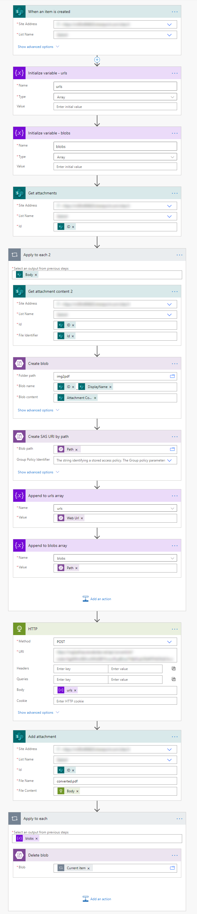

# Azure Function for converting image(s) to PDF


## Deploy via PowerShell

```
$resourceGroupName = "dev"
$functionAppName = "img2pdf"
$deploymentFile = New-TemporaryFile

# Create package
Remove-Item $deploymentFile.FullName
Compress-Archive -Path "./pic2pdf/bin/Release/net6.0/publish/*" -DestinationPath $deploymentFile.FullName

# Publish
$functionApp = Get-AzWebApp -ResourceGroupName $resourceGroupName -Name $functionAppName
Publish-AzWebapp -WebApp $functionApp -ArchivePath $deploymentFile

# Cleanup
Remove-Item $deploymentFile.FullName
```

## Local debugging in Visual Studio
Create a file `local.settings.json` with this content:
```json
{
  "IsEncrypted": false,
  "Values": {
    "AzureWebJobsStorage": "UseDevelopmentStorage=true",
    "FUNCTIONS_WORKER_RUNTIME": "dotnet",
  }
}

```

## Storing PDFs in Storage Account
Function `convertUrlsAsBlob` stores output document in Azure Blob storage. In order to authenticate against Storage Account it uses Managed Identity of Azure Function (needs to be enabled!). For local debugging from Visual Studio add these options to `loca.settings.json`:
```json
    "AZURE_CLIENT_ID": "3d51c45e-***-32292148f792",
    "AZURE_CLIENT_SECRET": "***",
    "AZURE_TENANT_ID": "b9202536-***-fd3ea48fbc6a",
```

To configure blob storage container to use set `OutputBlobContainerPath` configuration option.

## Sample flow


